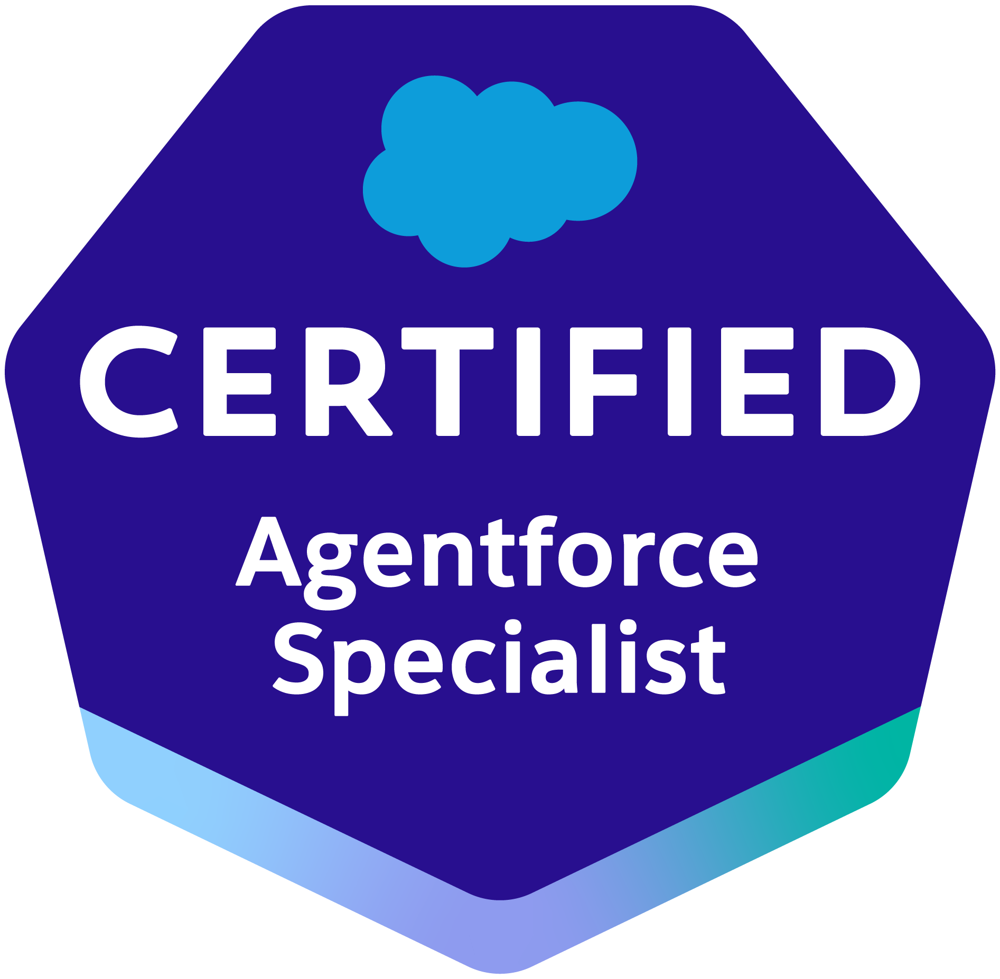
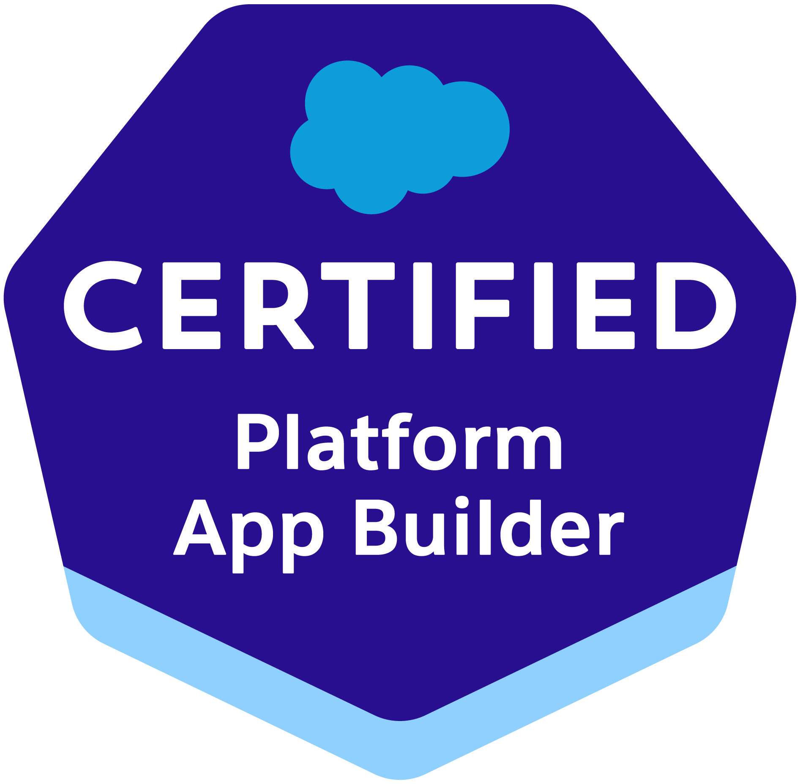
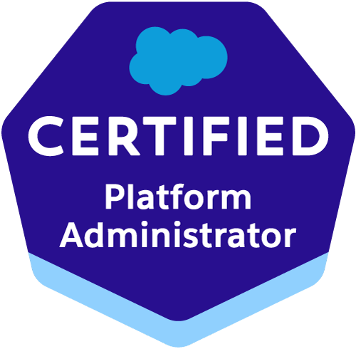
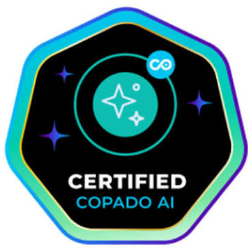
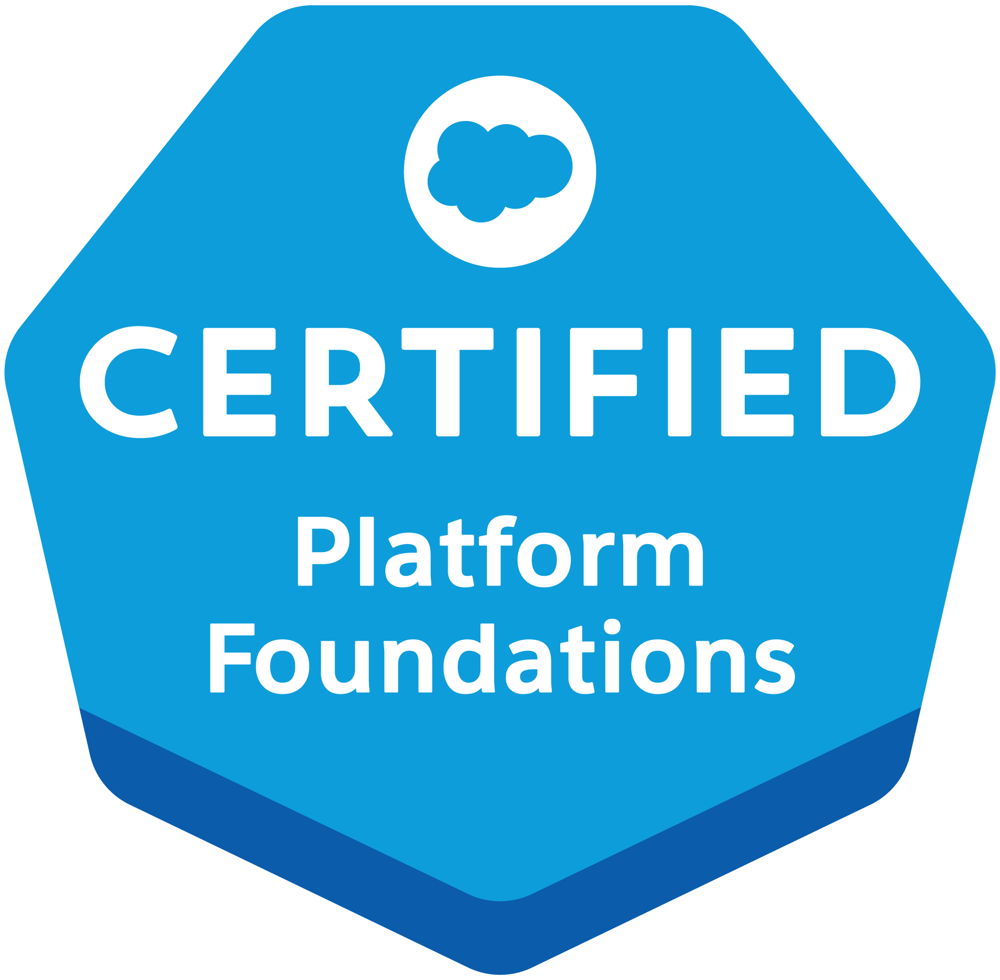

# Ángel Picado Cuadrado

### Salesforce Developer · Apex · LWC · Copado · Agentforce

Building reliable CRM solutions at **VIEWNEXT** · Based in **Salamanca, Spain**

---

### About me

Passionate **Salesforce Developer** delivering scalable platform solutions with **Apex**, **Lightning Web Components**, and **Copado**-based DevOps. I moved from Salesforce Administration into development, with a strong focus on quality, clean metadata, and safe deployments.

Computer Science graduate from the **University of Salamanca (USAL)**. Continuous learner in the Salesforce ecosystem — especially **Agentforce** and AI-assisted delivery.

- Apex & LWC development in agile teams
- Org administration, security, and metadata-driven solutions
- Copado pipelines from sandbox to production
- Unit / regression testing and data quality

---

### Certifications

Ordered by relevance to my current role. Full profile: [Trailblazer · angelpicado01](https://www.salesforce.com/trailblazer/angelpicado01)

| | | | | |
|:---:|:---:|:---:|:---:|:---:|
|  |  |  |  |  |
| **Agentforce Specialist** | **Platform App Builder** | **Platform Administrator** | **Copado AI Certified** | **Platform Foundations** |
| Nov 2025 | Sep 2025 | Jun 2024 | Apr 2026 | May 2023 |

---

### Tech stack

  

---

### Featured projects

#### [Salesforce Org Compare](https://github.com/angelcubo01/salesforceOrgCompare)

Chrome extension to compare Salesforce orgs using your browser session — metadata diffs, Apex tools, SOQL, REST, and more. No CLI required.

  

🌐 [salesforceorgcompare.com](https://salesforceorgcompare.com/)

#### [SF Deploy Guard](https://github.com/angelcubo01/sf-deploy-guard)

VS Code / Cursor extension that warns before you overwrite a teammate’s Salesforce changes — who changed it, when, and what to do next.

  

#### CountingDown

Capstone project (TFG) with **HP SCDS** — web app for personalized raffle ballot numbering. Grade **9/10**.

---

### Connect

[LinkedIn](https://linkedin.com/in/angelcubo01) · [Trailblazer](https://www.salesforce.com/trailblazer/angelpicado01) · [Email](mailto:angelpicadocuadrado@gmail.com)

**Let's build something great on Salesforce.**

